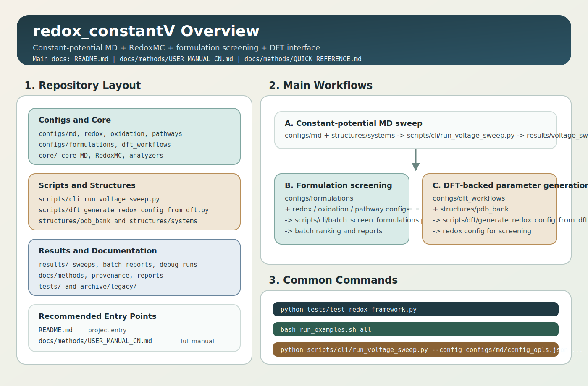

# 用户手册

## 1. 这套项目在做什么

本项目用于做三类工作：

1. 恒电位 MD 电压扫描
2. 电解液配方的氧化还原/高压稳定性筛选
3. 用 PySCF DFT 结果生成 screening 所需的有效参数

当前主线工作流是：

- `OpenMM constant-potential MD`
- `RedoxMC` 电荷态占有率模型
- `LSV/CV-like` 实验语境图
- `配方级 high-voltage screening`
- `PySCF -> screening config` 接口

如果你要区分“哪些结论是文献/实验支持的”和“哪些只是当前模型推论”，直接看：

- [EXPERIMENTAL_VALIDATION_AND_INFERENCE_CN.md](/home/am3-peichenzhong-group/Documents/project/project_solv_structure/redox_potential/redox_constantV/docs/provenance/EXPERIMENTAL_VALIDATION_AND_INFERENCE_CN.md)
- [references.md](/home/am3-peichenzhong-group/Documents/project/project_solv_structure/redox_potential/redox_constantV/docs/provenance/references.md)

## 1.1 总览图



## 2. 当前目录结构

```text
redox_constantV/
  configs/
    md/
    redox/
    oxidation/
    pathways/
    formulations/
    dft_workflows/
  core/
  scripts/
    cli/
    dft/
    plotting/
    utils/
  structures/
    pdb_bank/
    systems/
  ff/
  docs/
    methods/
    provenance/
    notes/
    reports/
  tests/
  results/
  archive/legacy/
```

建议你以后只从这些入口进入：

- MD 扫描: `scripts/cli/run_voltage_sweep.py`
- 配方批处理: `scripts/cli/batch_screen_formulations.py`
- DFT 接口: `scripts/dft/generate_redox_config_from_dft.py`

## 3. 环境依赖

### 3.1 CPU 基本环境

```bash
pip install \
  openmm>=8.4 \
  numpy>=1.24 \
  pandas>=1.5 \
  matplotlib \
  tabulate \
  pyscf>=2.12 \
  h5py>=3.16
```

### 3.2 GPU4PySCF 环境

```bash
pip install \
  pyscf>=2.12 \
  gpu4pyscf-cuda12x==1.6.0 \
  cupy-cuda12x==14.0.1 \
  cutensor-cu12==2.5.0 \
  pyscf-dispersion \
  geometric
```

注意：

- GPU4PySCF 路线需要 CUDA 用户态环境和显卡架构兼容。
- 当前项目代码已经支持 `gpu4pyscf` 后端。
- 但如果机器是较新的 Blackwell 卡，必须先确认本机 CUDA/CuPy/gpu4pyscf 组合真的支持该架构。

## 4. 先做什么检查

先跑框架自检：

```bash
python tests/test_redox_framework.py
```

如果你要检查 DFT 接口基本路径解析：

```bash
python scripts/dft/generate_redox_config_from_dft.py \
  --workflow configs/dft_workflows/example_ec_dmc_reduction.json \
  --output-dir results/dft_interface_validation_manual \
  --allow-missing-pyscf
```

## 5. 最常用的 3 条命令

### 5.1 恒电位 MD 电压扫描

```bash
python scripts/cli/run_voltage_sweep.py \
  --config configs/md/config_opls.json \
  --redox-config configs/redox/config_redox.json \
  --pdb structures/systems/start_with_electrodes.pdb \
  --output-dir results/sweep_manual
```

### 5.2 配方批处理筛选

```bash
python scripts/cli/batch_screen_formulations.py \
  --input configs/formulations/formulation_batch_example_extended.json \
  --output-dir results/formulation_batch_manual
```

### 5.3 用 DFT 生成 screening 配置

CPU 版：

```bash
python scripts/dft/generate_redox_config_from_dft.py \
  --workflow configs/dft_workflows/example_ec_dmc_reduction.json \
  --output-dir results/dft_interface_ec_dmc_manual
```

GPU4PySCF 版：

```bash
python scripts/dft/generate_redox_config_from_dft.py \
  --workflow configs/dft_workflows/example_ec_dmc_reduction_gpu.json \
  --output-dir results/dft_interface_ec_dmc_gpu_manual
```

## 6. 配置文件怎么分

### 6.1 `configs/md/`

- `configs/md/config_opls.json`
- 用于 OpenMM/OPLS 常电位 MD
- 指定：
  - 体系 PDB
  - force field XML
  - electrode 参数
  - MD 参数
  - output 文件名

### 6.2 `configs/redox/`

- 还原侧 screening 参数
- 典型字段：
  - `charge_states`
  - `electron_affinities`
  - `state_free_energy_offsets_kjmol`
  - `allowed_states`
  - `residue_names`

### 6.3 `configs/oxidation/`

- 氧化侧 screening 参数
- 通常定义 `0 -> +1`

### 6.4 `configs/pathways/`

- 不可逆分解或反应通道参数
- 典型字段：
  - `onset_v_vs_li`
  - `barrier_at_onset_kjmol`
  - `barrier_slope_kjmol_per_v`
  - `floor_barrier_kjmol`

### 6.5 `configs/formulations/`

- 配方批处理输入
- 只负责把 redox/oxidation/pathway 三套配置组合起来

### 6.6 `configs/dft_workflows/`

- DFT 工作流输入
- 指定：
  - 分子结构文件
  - 电荷态
  - 自旋
  - DFT 方法
  - 溶剂模型
  - 后端（CPU / GPU4PySCF）

## 7. 典型工作流

### 7.1 你已经有一套体系 PDB，想做电压扫描

步骤：

1. 检查 [configs/md/config_opls.json](/home/am3-peichenzhong-group/Documents/project/project_solv_structure/redox_potential/redox_constantV/configs/md/config_opls.json)
2. 检查 [configs/redox/config_redox.json](/home/am3-peichenzhong-group/Documents/project/project_solv_structure/redox_potential/redox_constantV/configs/redox/config_redox.json)
3. 运行 `scripts/cli/run_voltage_sweep.py`
4. 看 `results/.../voltage_sweep_results.csv`

### 7.2 你想直接筛配方，不先跑 MD

步骤：

1. 准备 `configs/formulations/*.json`
2. 运行 `scripts/cli/batch_screen_formulations.py`
3. 看：
   - `formulation_batch_summary.csv`
   - `formulation_batch_overview.png`
   - `FORMULATION_BATCH_REPORT_CN.md`

### 7.3 你想把单分子 DFT 接到 screening 参数

步骤：

1. 在 `structures/pdb_bank/` 放结构
2. 写 `configs/dft_workflows/*.json`
3. 跑 `scripts/dft/generate_redox_config_from_dft.py`
4. 用生成的 `redox_config_generated.json` 去替换或校准 `configs/redox/*.json`

## 8. DFT 接口的意义

这套接口不是“直接用 DFT 替代整个配方筛选”，而是把：

- 单分子或小团簇 DFT
- screening 模型

接起来。

它输出两层结果：

1. `dft_raw_results.json`
   - 原始 DFT 态能量
   - 相对能量
   - 推导出的 half-wave 电位

2. `redox_config_generated.json`
   - 可直接被 `RedoxMC` 用的 screening config

所以它的定位是：

- 给 screening 参数一个更有物理依据的起点
- 不是最终的配方级真值

## 9. 输出都在哪里看

### 9.1 电压扫描

典型输出：

- `voltage_sweep_results.csv`
- `voltage_sweep_summary.png`
- 每个电位点各自的 `config/log/dcd/pdb/charges`

### 9.2 配方批处理

典型输出：

- `formulation_batch_summary.csv`
- `formulation_batch_molecule_breakdown.csv`
- `formulation_batch_overview.png`
- `FORMULATION_BATCH_REPORT_CN.md`

### 9.3 DFT 接口

典型输出：

- `dft_raw_results.json`
- `redox_config_generated.json`

## 10. 现在最值得看的现成结果

如果你想快速看已有结论，优先看：

- 实验语境图和报告：
  - [results/experimental_redox_report_20260311_234115](/home/am3-peichenzhong-group/Documents/project/project_solv_structure/redox_potential/redox_constantV/results/experimental_redox_report_20260311_234115)
- 高压反应通道报告：
  - [results/reactive_pathway_20260311_235839_final](/home/am3-peichenzhong-group/Documents/project/project_solv_structure/redox_potential/redox_constantV/results/reactive_pathway_20260311_235839_final)
- 配方批处理示例：
  - [results/formulation_batch_20260312_002500_extended](/home/am3-peichenzhong-group/Documents/project/project_solv_structure/redox_potential/redox_constantV/results/formulation_batch_20260312_002500_extended)

## 11. 常见问题

### 11.1 为什么 screening 和单分子 DFT 数值不一样

因为 screening 不是纯分子热力学，它还吸收了：

- 溶剂环境
- Li+ 配位
- 配方上下文
- 界面失效趋势

所以 screening 参数允许在 DFT 基础上再加有效修正。

### 11.2 为什么 GPU4PySCF 可能跑不起来

最常见原因不是脚本，而是 GPU 软件栈不匹配：

- CUDA 版本太旧
- CuPy wheel 不支持当前显卡架构
- `gpu4pyscf` 与本机驱动/用户态不匹配

### 11.3 历史文件在哪

旧流程和旧作业文件在：

- `archive/legacy/`

它们保留作参考，不建议再当主入口使用。

## 12. 建议你以后怎么用

推荐顺序：

1. 先跑 `tests/test_redox_framework.py`
2. 用批处理快速筛配方
3. 对关键分子再跑 DFT 接口
4. 再把 DFT 结果回填到 screening 配置
5. 最后对 shortlist 做常电位 MD 或更细的反应路径分析
